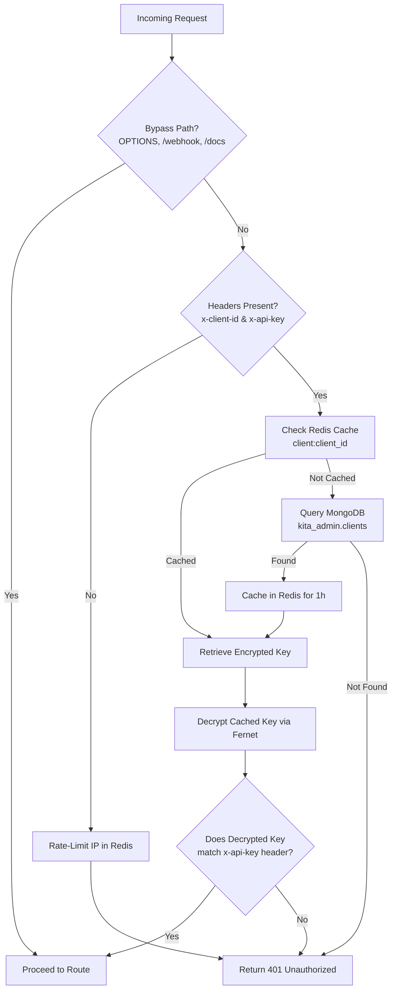

# 💻 Local Development Guide

This guide describes how to configure, run, and develop the `kita-api` service locally.

---

## 📋 Prerequisites

Ensure you have the following installed on your development machine:
- **Python**: `>= 3.13`
- **`uv`**: Astral's high-performance Python package manager (refer to the [`uv` installation guide](https://docs.astral.sh/uv/getting-started/installation/))
- **MongoDB**: A local instance or access to a MongoDB Atlas cluster
- **Redis**: A running Redis server for session caching and rate-limiting

---

## 🚀 Getting Started

### 1. Initialize the Environment
Clone the repository and run `uv sync` to automatically create a virtual environment (`.venv`) and install all lockfile dependencies:
```bash
# Sync files and dependencies
uv sync
```

### 2. Configure Environment Variables
Copy the template configuration file:
```bash
cp .env.example .env.local
```

Open `.env.local` and configure the required keys. Below is an overview of the key variables:

| Variable | Description | Default / Example |
| :--- | :--- | :--- |
| `MONGO_URI` | MongoDB connection URI | `mongodb://localhost:27017` |
| `MONGO_DB_NAME` | Database name for Kita services | `kita_db` |
| `REDIS_CONNECTION_STRING` | Redis server connection URI | `redis://localhost:6379/0` |
| `API_KEY_ENCRYPTION_KEY` | Secret key for decrypting client API keys | *Generated automatically on first client creation* |
| `OPENROUTER_API_KEY` | API token for OpenRouter LLM routing | *(Required for agent routing)* |
| `CORS_ALLOWED_ORIGINS` | Comma-separated list of allowed origin hosts | `http://localhost:3000` |

### 3. Run the Dev Server
To start the FastAPI server with auto-reload enabled:
```bash
uv run uvicorn main:app --reload
```
Once started, the API will be available at `http://localhost:8000`, and you can explore the interactive OpenAPI documentation at [http://localhost:8000/docs](http://localhost:8000/docs).

---

## 📦 Dependency Management

This project uses Astral `uv` for dependency management, locking packages in `uv.lock` and defining them in `pyproject.toml`.

- **Adding a new dependency**:
  ```bash
  uv add <package-name>
  ```
- **Adding a development-only dependency**:
  ```bash
  uv add --dev <package-name>
  ```
- **Syncing environment packages with lockfile**:
  ```bash
  uv sync
  ```

---

## 🔒 Client Credentials & API Key Management

Kita API protects all routes (excluding webhooks and OpenAPI docs) using the [ApiKeyAuthMiddleware](./app/middleware/api_key_auth.py). To invoke the endpoints, a client application must pass two identification headers:
1. `x-client-id`: The identifier assigned to the client.
2. `x-api-key`: A plaintext API key generated for the client.

### 🛠️ Creating a New Client
To register a new client and generate credentials, run the client generation script:

```bash
uv run python scripts/generate_client.py <client_id>
```

#### What the Script Does:
1. **Reads Environment Variables**: Loads settings from `.env.local` and `.env`.
2. **Handles Encryption Key**: Checks for the existence of `API_KEY_ENCRYPTION_KEY`. If not set, it generates a new Fernet key, appends it to `.env.local`, and loads it.
3. **Generates Client Details**: Generates a new unique `ObjectId` to serve as the client's raw API key (`x-api-key`).
4. **Encrypts the Key**: Encrypts the raw API key using the `API_KEY_ENCRYPTION_KEY`.
5. **Saves to MongoDB**:
   - Establishes a connection using `MONGO_URI`.
   - Uses the `kita_admin` database and the `clients` collection.
   - If a client with the same `client_id` already exists, it is **deleted and overwritten** (invalidating old keys).
   - Inserts the new record where the `_id` is the encrypted API key, and `client_id` is your specified ID.
6. **Outputs Credentials**: Prints out the values for `x-client-id` and `x-api-key` in a secure console frame.

> [!WARNING]
> Keep the generated `API_KEY_ENCRYPTION_KEY` secure. If this key is changed or lost, all existing encrypted keys in the database will become impossible to decrypt, effectively revoking all client access.

---

### 📞 Calling the API from an Existing or New Client

Any client calling Kita API must include `x-client-id` and `x-api-key` in its HTTP request headers.

Here are examples of making authorized requests:

#### 1. cURL Example
```bash
curl -X GET "http://localhost:8000/" \
  -H "x-client-id: my-client-app" \
  -H "x-api-key: 6665c829e1c8b32d20123456"
```

#### 2. JavaScript / Fetch Example
```javascript
const makeApiRequest = async (endpoint, options = {}) => {
  const headers = {
    "Content-Type": "application/json",
    "x-client-id": process.env.KITA_API_CLIENT_ID,
    "x-api-key": process.env.KITA_API_KEY,
    ...options.headers
  };

  // Include user bearer token if calling JWT-protected endpoints
  if (options.token) {
    headers["Authorization"] = `Bearer ${options.token}`;
  }

  const response = await fetch(`http://localhost:8000${endpoint}`, {
    ...options,
    headers
  });
  return response.json();
};
```

#### 3. Python / HTTPX Example
```python
import httpx

async def fetch_data():
    headers = {
        "x-client-id": "my-client-app",
        "x-api-key": "6665c829e1c8b32d20123456"
    }
    
    async with httpx.AsyncClient() as client:
        response = await client.get("http://localhost:8000/chats", headers=headers)
        return response.json()
```

---

### ⚙️ How Authentication Works Under the Hood

When a request hits Kita API, the [ApiKeyAuthMiddleware](./app/middleware/api_key_auth.py) processes it as follows:



1. **Bypass Checks**: Skips verification for CORS preflight (`OPTIONS`), webhooks (`/webhook`), and interactive documentation (`/docs`, `/openapi.json`, `/redoc`).
2. **Missing Header Rate-Limiting**: If either header is missing, the request IP is rate-limited using Redis (maximum 10 unauthenticated requests/min) to prevent abuse, and returns a `401 Unauthorized` response.
3. **Cache Lookup**: Looks up the client record by `client_id` in Redis.
4. **Database Fallback**: If cache misses, queries MongoDB (`kita_admin.clients`), fetches the encrypted API key, and caches it in Redis for 1 hour (`TTL 3600`).
5. **Decryption & Match**: Decrypts the stored API key using `API_KEY_ENCRYPTION_KEY` and compares it to the incoming `x-api-key`. If successful, the request goes through; otherwise, returns `401 Unauthorized`.
